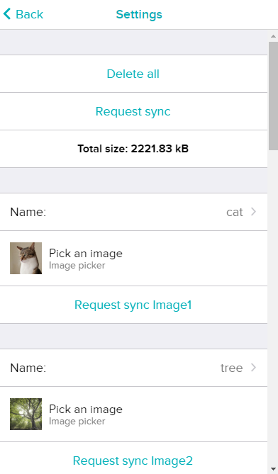

# Image Viewer
The application allows you to view pictures on the watch. The user uploads the images in the settings and then can view them on the watch (maximum 21 images / depends on the size of the image). In the application, all uploaded images are displayed in a list (there are two display modes: tiles and list, you can change this by clicking on the icon on right of the "IMAGE header"). In tiles list mode you can seen max 6 images on the page. Page you can change be swiping. To show an image from the list, just click on it. To return back to the list, click on the maximized image.

Available in Fitbit gallery: https://gallery.fitbit.com/details/33e5fac2-b8a8-4deb-b41f-a87cd6099c23

## List of pictures

  
  
  

## Image display

  
  
  

## Instructions for uploading and deleting
You can add new images in the settings of this application on your mobile in the Fitbit application. After adding an image to the settings, it will be automatically uploaded to the watch. Sometimes a connection error may occur that the image will not move to the watch (then you must click the "Reqest sync" button and synchronize the watch data with the mobile data). It can synchronize all images (button at the top) or one specific image (button below the image). The images can be deleted with the "Delete all" button. If you are replacing uploaded images, you must restart the watch application for the changes to take effect. It is also possible set image name (max. length of image name is 20 chars). Image names are visible only in "list mode". 

## Settings
  * Delete all
  * Reqest sync (one image / all)
  * Upload new image
  * Set name of image

  

