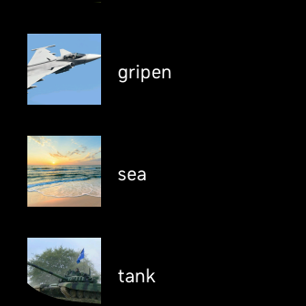

# Image Viewer
The application allows you to view pictures on the watch. This application is designed for Fitbit Versa 3. The user uploads the images in the settings and then can view them on the watch (maximum 20 images). In the application, all uploaded images are displayed in a list. To view an image from the list, just click on it. To return back to the list, click on the maximized image.

Available in Fitbit gallery: https://gallery.fitbit.com/details/33e5fac2-b8a8-4deb-b41f-a87cd6099c23

## Instructions for uploading and deleting an image
You can add new images in the settings of this application on your mobile in the Fitbit application. After adding an image to the settings, it will be automatically uploaded to the watch. Sometimes a connection error may occur that the image will not move to the watch (then you must click the "Reqest sync" button and synchronize the watch data with the mobile data). It can synchronize all images (button at the top) or one specific image (button below the image). The images can be deleted with the "Delete all" button. If you are replacing uploaded images, you must restart the watch application for the changes to take effect.

## Settings
  * Delete all
  * Reqest sync
  * Upload new image

  

## List of pictures

  

## Image display

  
  

